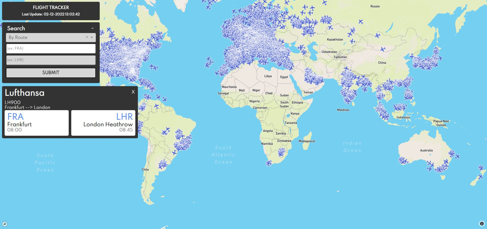

# Flight Tracker
The Flight Tracker App provides the user a way of following currently flying airplanes, as well as different way of searching for a particular flight.

# Prerequisites

- A Lufthansa [API key](https://developer.lufthansa.com/) must be registered
- A Mapbox [access token](https://account.mapbox.com/) must be registered
- Make a  `.env` file at the root of the project with the following environment variables
    ```bash
    LUFTHANSA_API_KEY=<your_api_key>
    OPENSKY_BASE_URL=https://opensky-network.org/api/states/all
    MAPBOX_API_TOKEN=<your_mapbox_access_token>
    DATA_PATH=.\data
    BASE_URL_CFI=https://api.lufthansa.com/v1/operations/customerflightinformation/
    BASE_URL_SCHEDULES=https://api.lufthansa.com/v1/flight-schedules/flightschedules/passenger?
    ```

# Setup

**Docker** must be installed and running on your platform

Run the [Docker Compose file](docker-compose.yml) with:

```bash
docker compose up
```
# Getting Started

The App has a few functionalities such as :
- Display infos when clicking on an airplane on the map
- Search a flight
- Search route infos
- Search airport for departures and arrival

In the **Search** bar, the airport fields must be IATA codes

# TODOs

- Get item suggested when typing in a field of the search panel
- Display the track of the airplane when clicking on it

# Web Interface

**Overview**


**Click on airplane**


**Hover on airplane**


**Route**



**Departures and Arrivals**


